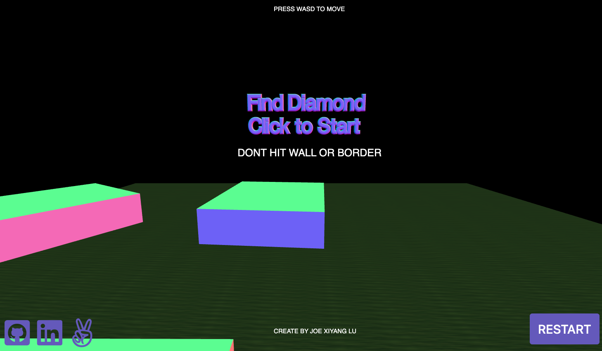

# FindDiamond

FindDiamond is a maze game inspried by Minecraft and Maze. The goal of this game is to find one big diamond in the game map.

The app uses vanilla JavaScript DOM manipulation for game controls and game action prompts. 3-D objects were built using the
[three.js](https://threejs.org/) library.

[FindDiamond Live Demo](https://joexylu.github.io/FindDiamond/) (best played on a desktop or laptop)



## How to Play the Game
- The user uses keyboard to control movement of ball.
- Click the game window to start the gameplay.
- If the ball touchs the border or block object in the map, the ball goes back to origin automatically.
- Successfully find the diamond in the map to win.

## Implementations

### Ball Movement

With the use of simple vanilla JS DOM manipulation and KeyboardState functionality from three.js, the game listens to user pressing keyboard and move the ball in the game map. Here is the code:

```JavaScript
var keyboard = new THREEx.KeyboardState();
var delta = clock.getDelta(); // seconds.
var moveDistance = 5 * delta;

// move forwards/backwards
if (keyboard.pressed("W") ) Ballsphere.translateZ( -moveDistance );
if ( keyboard.pressed("S") ) Ballsphere.translateZ(  moveDistance );

```

### Camera Postions

This functionality allows display can follow ball's movement.

```JavaScript
var relativeCameraOffset = new THREE.Vector3(0,3,5);
var cameraOffset = relativeCameraOffset.applyMatrix4( Ballsphere.matrixWorld );

camera.position.x = cameraOffset.x;
camera.position.y = cameraOffset.y;
camera.position.z = cameraOffset.z;
camera.lookAt( Ballsphere.position );

```
### Collision Detection

With the geometric calculation of distance between the center of the ball and object blocks in the game, I was able to detect the collision.

```JavaScript
var originPoint = Ballsphere.position.clone();
for (var vertexIndex = 0; vertexIndex < Ballsphere.geometry.vertices.length; vertexIndex++)
{		
    var localVertex = Ballsphere.geometry.vertices[vertexIndex].clone();
    var globalVertex = localVertex.applyMatrix4( Ballsphere.matrix );
    var directionVector = globalVertex.sub( Ballsphere.position );
    var ray = new THREE.Raycaster( originPoint, directionVector.clone().normalize() );
    var collisionResults = ray.intersectObjects( collidableMeshList );
    var winning = ray.intersectObjects( winningMesh );
    if ( collisionResults.length > 0 && collisionResults[0].distance < directionVector.length() ){
        collided = true
    } 
    if ( winning.length > 0 && winning[0].distance < directionVector.length() ){
        win = true;
    }
}    

```

## Future Featrues

- Using Physijs to achieve real physical behaviors in the game.
- Introduce scoring and level progression.